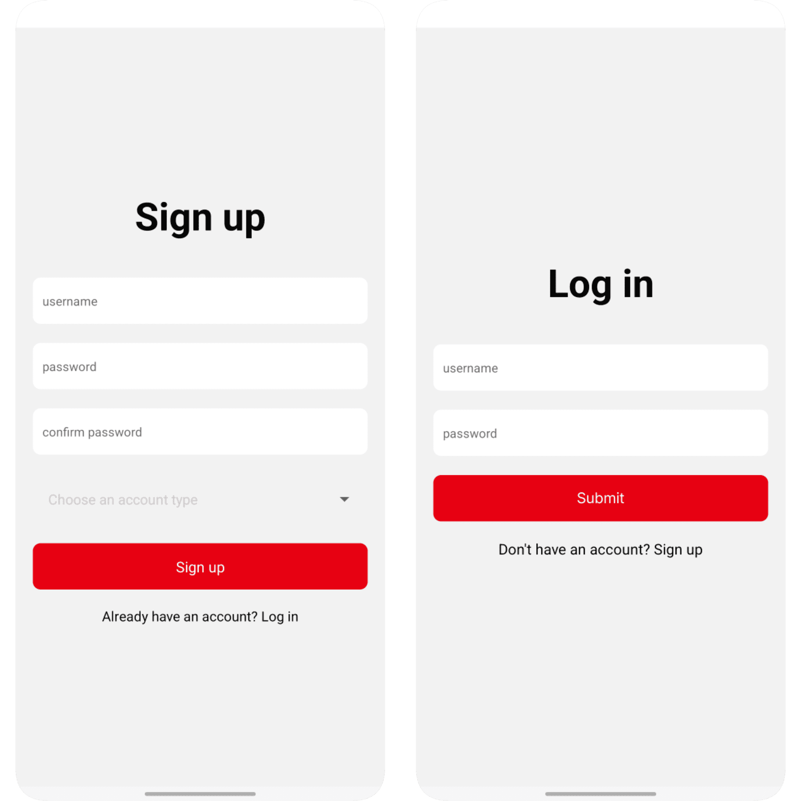
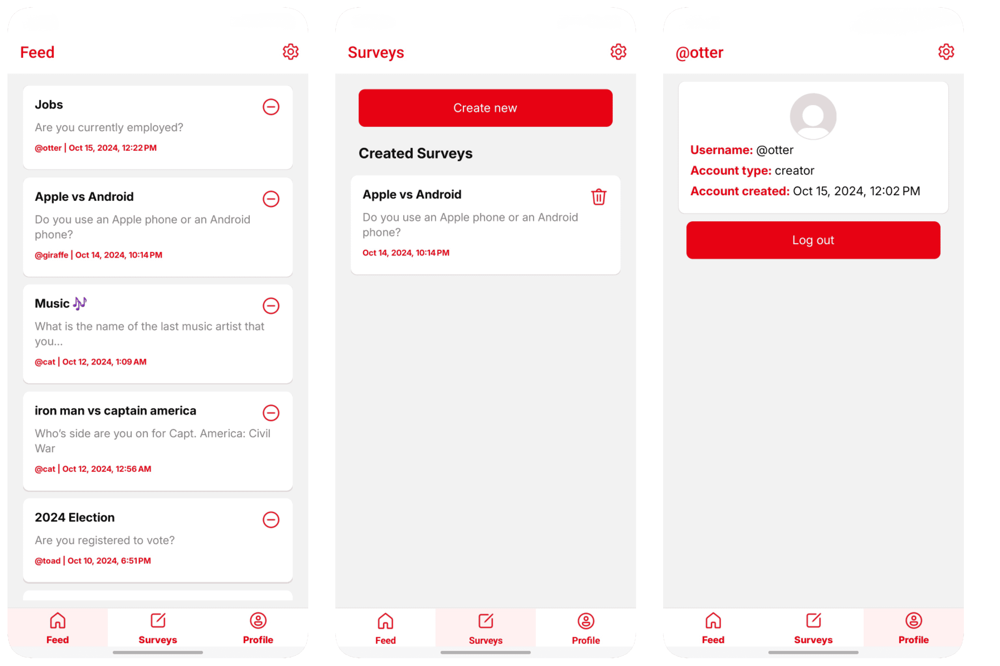
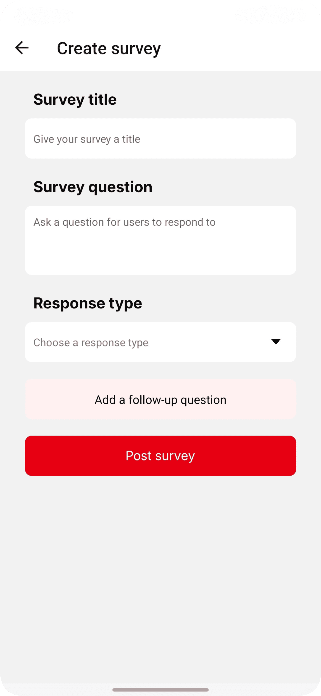
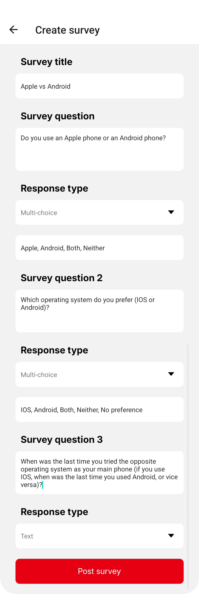
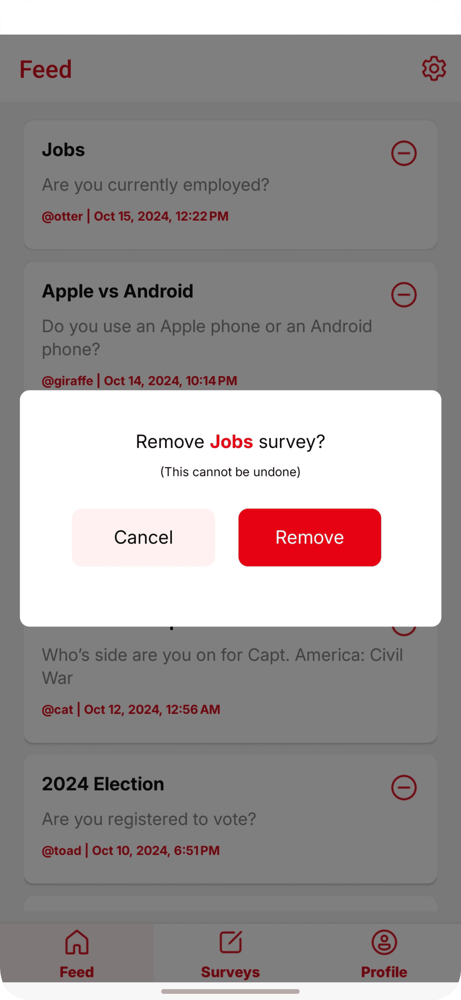
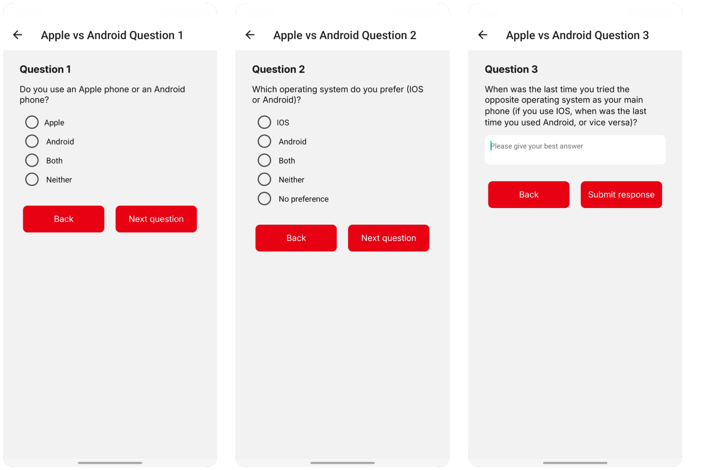
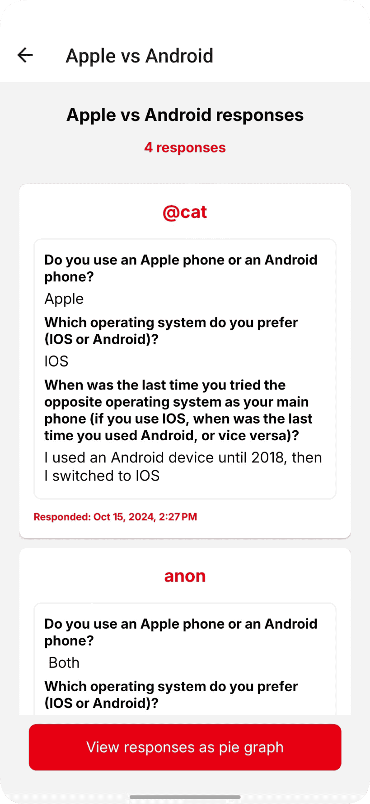
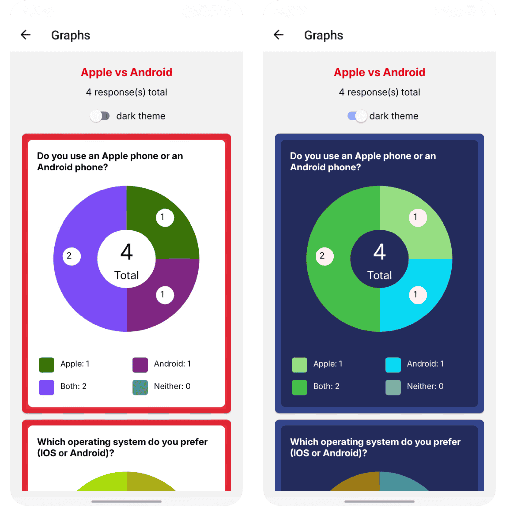
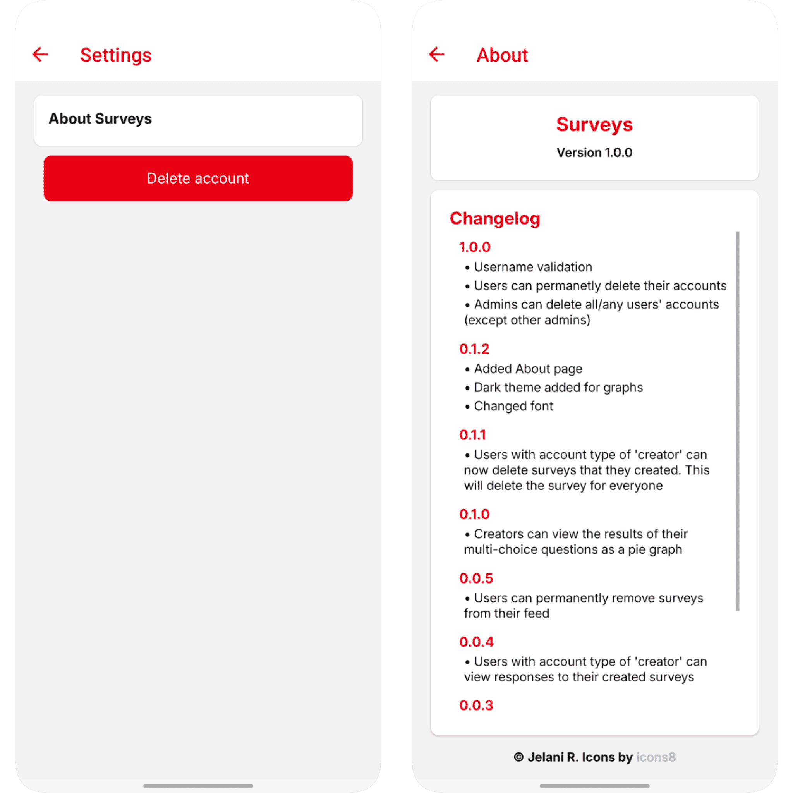
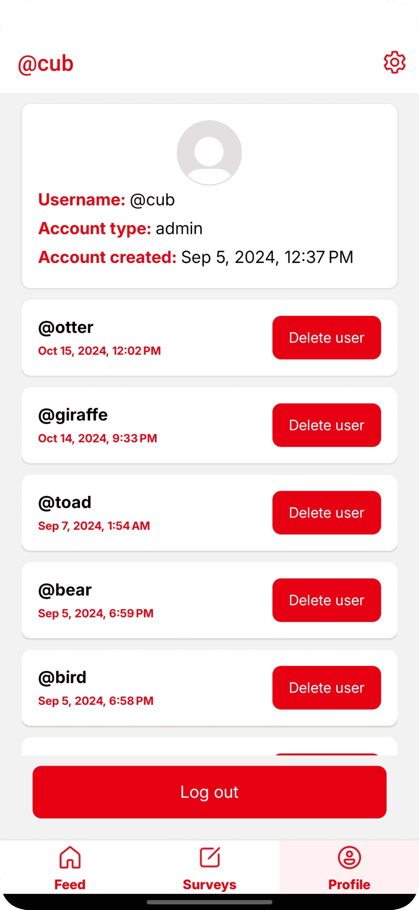

# Surveys

**Discover insights with ease!** Introducing *Surveys*, the mobile app for IOS and Android where curiosity meets simplicity. With the Surveys app, users can create and share surveys on any topic—whether it’s gathering opinions, crowd-sourcing ideas, or simply having fun. Respondents answer a mix of multiple-choice or text-based surveys, and they have the option to remain anonymous for added privacy.

**What sets Surveys apart?** Creators gain instant access to detailed results, including auto-generated pie graphs for a clear visual breakdown of the responses to their surveys. From casual polls to in-depth feedback, the Surveys app offers the perfect space for connection and data-driven insights in a simple, privacy-conscious platform.

## Creator & developer: Jelani R

## Version: 1.0.1

## Architecture

This project is built with React Native using Expo. The language used is JavaScript.

The backend for this project is [here](https://github.com/Jchips/surveys-api). It uses Nodejs, Express, MySQL or PostgreSql (either is supported), JWT, and Sequelize.

*to switch to using PostgreSQL, search for 'PostgreSQL' throughout all files and then follow directions from the comments for each result that shows up. Currently using a MySQL db.

## App Images

Surveys app screenshots. All taken on a Samsung Galaxy S22.

### Authentication

A username can't be used more than once.

Users can choose between a 'User' or a 'Creator' account type. Creator type accounts can post surveys and respond to surveys. User type accounts can only respond to surveys.

### Tabs

The Feed, Surveys, and Profile tabs. For users with the account type of 'User', the Surveys tab will not appear (only appears for Creators and Admins).

### Creating a survey

### Creating a survey (example)

Creators can choose between text responses or multi-choice responses. Separate the multi-choice options with commas.

Creators can ask up to 3 questions in their surveys.

### Removing a survey

Users can permanently remove a survey from their personal feed that they don't plan to respond to.

### Respond to a survey

Users can choose to respond to surveys anonymously. Their username will not be tied to their response.

### View responses to a surveys

Creators can view the responses to the surveys that they created (but not the responses to other Creators' surveys).

### View responses as graphs

Creators can view the responses to their multi-choice questions as pie graphs. The graphs have a dark theme option if users prefer.

The graph colors are randomized.

### Settings and About

Users can permanantly delete their accounts. This will remove any created surveys that they made and the responses to them, but any responses that a user has submitted to survey from their feed will remain. Their username will be removed from all their responses.

### Admin profile

Admins have the ability to permanently delete users (with the exception of other Admins).

## Resources

- [React Navigation](https://reactnavigation.org/docs/stack-navigator/)
- [React hook form](https://react-hook-form.com/)
- [React Native Picker Select](https://www.npmjs.com/package/react-native-picker-select/v/8.0.0)
- [React Native Radio Buttons Group](https://www.npmjs.com/package/react-native-radio-buttons-group)
- [react-native-keyboard-aware-scroll-view](https://www.npmjs.com/package/react-native-keyboard-aware-scroll-view)
- [React Native Gifted Charts](https://www.npmjs.com/package/react-native-gifted-charts)
- [Random color generator code](https://commerce.nearform.com/open-source/victory-native/docs/polar/pie/pie-charts)
- [icons8](https://icons8.com/)
- ['Inter' Google font by Rasmus Andersson](https://fonts.google.com/specimen/Inter)

## Changelog

- 1.0.1 (11-29-2024, 9:19pm) - Switched to support MySQL database.
- 1.0.0 (10-22-2024, 12:34am) - Refactored database. Users can permanently delete their accounts. Admins can delete users' accounts.
- 0.1.2 (10-16-2024, 2:48am) - About page, dark theme graphs. changed font, added loading symbol.
- 0.1.1 (10-12-2024, 2:40am) - Creators can now delete surveys that they created. This will delete the survey for everyone.
- 0.1.0 (10-11-2024, 8:31pm) - Users can view the results of the multi-choice questions as a pie graph.
- 0.0.5 (10-10-2024, 6:58pm) - Users can permanently remove surveys from their feed.
- 0.0.4 (09-08-2024, 2:03pm) - Users can view responses to their created surveys.
- 0.0.3 (09-06-2024, 6:49pm) - Users can respond to surveys.
- 0.0.2 (09-04-2024, timeam) - Profile, Settings, Surveys page. User can create surveys if they have an account type of creator (or admin).
- 0.0.1 (09-01-2024, 1:58am) - Initial commit with functional login and signup forms.
